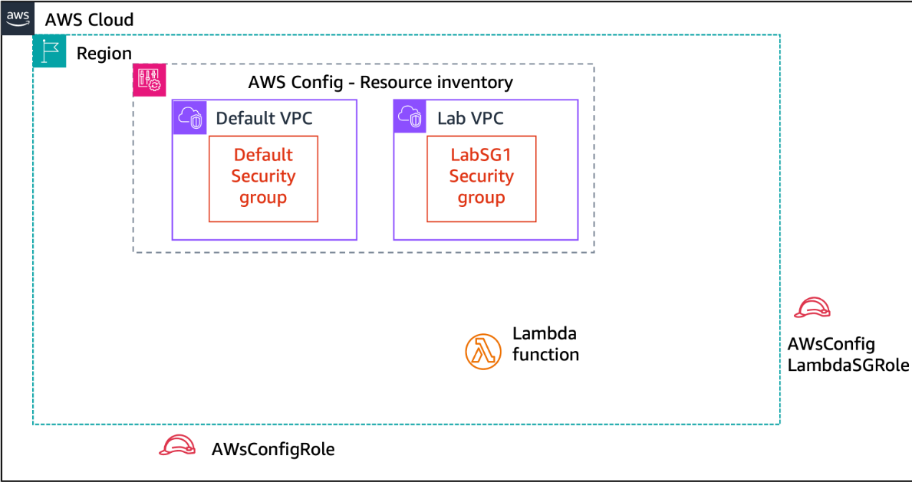
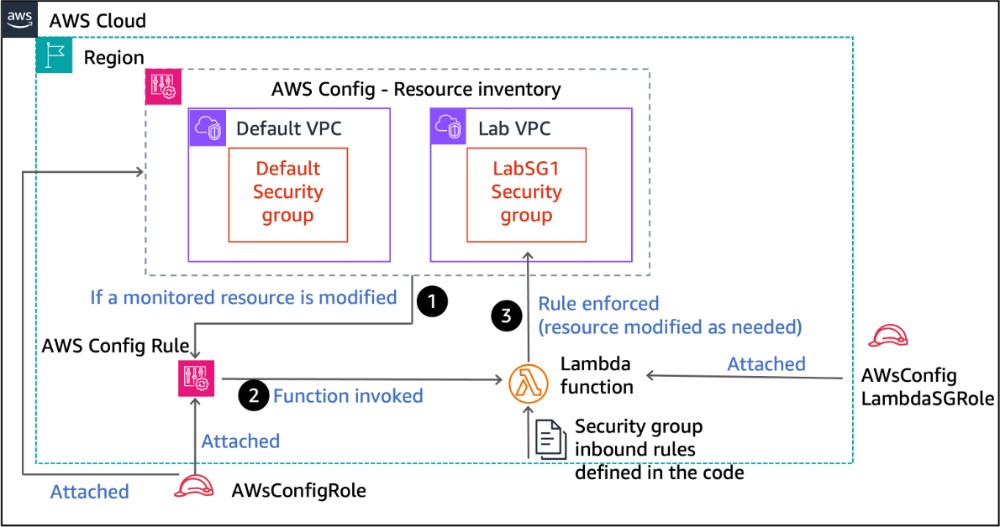

# ✳️ Auto-Remediating Security-Group Drift with **AWS Config** + **Lambda**

_AWS Security / Incident-Response Lab – July 2025_  
Author • Aykhan Pashayev – Aspiring Cloud Security Engineer

---

## 🚀 Executive Summary
Mis-configured security groups remain one of the most common cloud missteps and a favourite attacker foothold.  
This mini-project demonstrates **full, hands-off remediation** of unauthorised inbound-rule changes:

| ✔︎ Goal | 👇 Implementation |
|--------|-------------------|
| Detect any modification to **EC2 SecurityGroup** resources | **AWS Config** recorder + _custom_ Config rule |
| **Self-heal** the security group so only 80/443 remain open | **AWS Lambda** function invoked by the Config rule |
| Generate a forensic trail | Writes to **CloudWatch Logs** – searchable for auditing |
| Operate with least-privilege | 2 purpose-built **IAM roles** (Config-only & Lambda-only) |

The end result is a *zero-touch* guard-rail: as soon as someone (or something) opens a forbidden port,
the change is rolled back within seconds and the action is logged for post-incident review.

---

## 🖼️  Architecture

| **Before** – baseline resources                                          | **After** – auto-remediation flow in place |
|:------------------------------------------------------------------------:|:------------------------------------------:|
|           |  |

1. **AWS Config Recorder** tracks SecurityGroup configs.  
2. A **custom Config Rule** is triggered on every change.  
3. Rule invokes a **Lambda** function (Python, boto3).  
4. Lambda compares actual ingress rules with the approved baseline (80/443, IPv4+IPv6).  
5. Non-compliant rules are **revoked** and the fix is pushed via the EC2 API.  
6. Every evaluation & remediation step is logged to **CloudWatch Logs**.  

---

## 📂 Repo Layout

```text
aws-config-lambda-remediation-lab/
├─ architecture/
│ ├─ beginning-of-the-lab.png
│ └─ end-of-the-lab.png
├─ screenshots/ # key proof-points
│ ├─ Permissions showing both S3Access and AWS_ConfigRole.png
│ ├─ Confirmation of AWS Config dashboard.png
│ ├─ Resource inventory showing at least 2 security groups.png
│ ├─ Inbound rules with 4 entries (HTTP, HTTPS, SMTPS, IMAPS).png
│ ├─ Rule details with scope and debug=true parameter.png
│ ├─ Cleaned up inbound rules (only HTTP + HTTPS for IPv4 IPv6).png
│ └─ CloudWatch log entry showing “revoking for port 465 and 993”.png
└─ README.md
```
---

> **Tip**: Clone / fork to replicate the lab or adapt the code to your own estate.

---

## 📝  Step-by-Step Walk-through

### 1️⃣  IAM – Principle of Least Privilege  
**Screenshots:**  


* `AwsConfigRole` – AWS-managed **AWS_ConfigRole** plus a tiny inline S3 policy for snapshot delivery.  
* `AwsConfigLambdaSGRole` – Custom inline policy granting only:  
  `logs:*`, `ec2:DescribeSecurityGroups`, `ec2:AuthorizeSecurityGroupIngress`, `ec2:RevokeSecurityGroupIngress`, `config:PutEvaluations`.

---

### 2️⃣  AWS Config – Recorder Setup  


* **Recording strategy:** _Specific type_ → `AWS::EC2::SecurityGroup`  
* Delivery channel: S3 bucket (7-year retention) + default SNS disabled  
* IAM Role attached: `AwsConfigRole`

Result: Config now snapshots every Security Group change in **us-east-1**.

---

### 3️⃣  Baseline Drift – Simulated Incident  


Added **SMTP (465)** and **IMAPS (993)** to `LabSG1`. This puts the SG in a _non-compliant_ state.

Config inventory confirms it’s tracking the SGs:  


---

### 4️⃣  Custom Config Rule + Lambda  


* Rule name: `EC2SecurityGroup`  
* Trigger: **When configuration changes**  
* Scope: resource type = SecurityGroup  
* Lambda ARN: _awsconfig_lambda_security_group_  
* Parameter `debug=true` ⇒ verbose CloudWatch logging for demos

---

### 5️⃣  Automatic Remediation in Action  
Seconds after the rule evaluates, Lambda revokes the rogue ports:

| Evidence | Description |
|----------|-------------|
|  | SG ingress list shows **only 80/443** (v4 + v6) |
|  | Lambda log lines: `revoking for sg-… port 993`, `port 465` |

Mission accomplished: drift detected & healed automatically.

---

## 📊  Outcome

| KPI | Value |
|-----|-------|
| Mean Time to Detect (MTTD) | **< 1 sec** (Config delivers change notification) |
| Mean Time to Remediate (MTTR) | **~4 sec** (Lambda execution) |
| Human effort | **0** – remediation is serverless & event-driven |

---

## 💡  What You Should Notice

1. **Security-as-Code** – Guard-rails defined by code (Lambda) not run-books.  
2. **Event-Driven Ops** – Leveraging native AWS services instead of cron or polling.  
3. **Cost-Efficient** – Entire solution runs on the AWS free tier (Config snapshots aside).  
4. **Least-Privilege IAM** – Custom roles limit blast radius.  
5. **Operational Excellence** – CloudWatch logs, long-term S3 retention, clear metrics for MTTD/MTTR.

---

## 🔭  Next Steps

* Extend Lambda to send a Slack / Teams webhook for SOC visibility.  
* Use AWS Organizations + Aggregators to apply this rule cross-account.  
* Wrap everything in **AWS CDK** for production-grade CI/CD.

---

## 📚  References

* [AWS Config Developer Guide](https://docs.aws.amazon.com/config/latest/developerguide/)  
* [AWS Lambda Best Practices](https://docs.aws.amazon.com/lambda/latest/dg/best-practices.html)  
* [Security Group Rules Cheat-Sheet](https://docs.aws.amazon.com/vpc/latest/userguide/security-group-rules.html)

---

> © 2025 Aykhan Pashayev – Screenshots & diagrams used under AWS Educational Fair Use.
>  
>  _My LinkedIn – **https://linkedin.com/in/aykhanpashayev**
